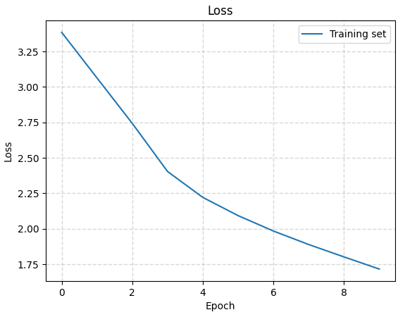

# RNN Bible Generator

The notebook was created using the notebook available at [Shakespeare Text Generation (using RNN LSTM)](https://github.com/trekhleb/machine-learning-experiments/blob/master/experiments/text_generation_shakespeare_rnn/text_generation_shakespeare_rnn.ipynb).

This repository contains a [Jupyter](https://jupyter.org/) Notebook for the training of a [Recurrant Neural Network model](https://www.tensorflow.org/guide/keras/working_with_rnns) for generating new Bible quotes.

### Libraries

- [TensorFlow](https://www.tensorflow.org/) — Creating and training model
- [Matplotlib Pyplot](https://matplotlib.org/stable/) — Visualising results
- [Numpy](https://numpy.org/) — Processing data
- [Pandas](https://pandas.pydata.org/) — Loading data

### Data

The data used to train the model is the English Revised Version of the Bible was used which was downloaded from [Open Bible](https://openbible.com/texts.htm).  
The Bible downloaded as a TXT file has 31,102 lines of text, with the specific section of the Bible the quote is from at the start of each line.

### Process

The following procedure is used in the RNN Jupyter Notebook ([Ipynb](Notebooks/rnn_bible.ipynb), [PDF](Notebooks/rnn_bible.pdf)) to process and visualise the data:

1. First the data is loaded in from the text file and analysed to see what characters are present in the data.
2. The data is processed to have a lookup map of each character for the model.
3. The images are then shuffled and batched.
4. Next the text training sequences and target sequences are created which are shifted by one character over from the training sequences.
5. The data is split into batches for faster processing.
6. The model is built using a Sequential model with 3 layers. Embedding Layer, used for input and as a lookup table. LSTM Layer, core of the model, the RNN. Dense Layer, used for the output.
7. The model is trained with a checkpoint set.

   _Loss Funciton History for RNN:_  
   

8. After the model is finished the latest checkpoint is loaded and the batch size of the model is changed to 1 to allow for inputting characters one at a time.
9. The generate text function is then used to generate new text using different amounts for the temperature.  
The following text was created using temperature of 1:  
    `Jesus: 55	OL	O0	Affrith in the dard offremen; ind uplahninad; atder fas wis sonctoop this that tron whines the wall ond noupe of merin; and thao shill youg? ind to doelt, they foreded: Jecoughous int thears of Saroms.
    Mout 115:2	As upeint inatianf of the brangstrongsh of foo them becess comne has cwater.
    Detian 1:13	Mowein, bat pathunger affore; sais, thou servet not forery, and cerdining athernele, aul greming int the ringrongs not unto me, at mey gime of the pertur colamanitine limy pastlesings welclet the ladsato thes, not the ball chasservany shall bee ineled all repeshels.
    Jocmutious 11:1	notery, anr the bladstreds; and the fordin.
    2 Corintist 22:10	Betwiry lough thare vere of in Godwtitice ferom unto them houds, Jold whelhed in the wound of all the prictiting of and dave forings: theigher is lidgelt, watt he seath to his wrindenatto nou efterd with no me damo in mang.
    Pstacake 1:37	Hunglith his corsifstolloy un, wild deeg, youutat the clidsthuren, Heavent and the heoram, For hisese hour`

And the following with temperature of 0.48:  
    `Jesus: Chrill shall be the king of the wither of the LORD.
    Jukn 1:15	And whou shall be were be the shald of Israel be the came of the right of the hither shall be not shall be for the wouss, be so did of the LORD his heard not said unto the mand of the came of the ear of the sent of the belle, which the wers of the taing of the LORD have saing him that waid shall be be anderinged the plipst of the LORD and he paking of the mand of the couns of the wints in the LORD that I will not the ward with the king.
    Psalm 16:13	And the hild of the prest of the LORD the sang of the seaples of his death.
    2 Chronicles 11:2	And is shall be wist the LORD, and the ball of the sand of the son on the ford and the hime of the said of the that the touph of the brong of the LORD the LORD wert be and of his saing, that we the wild of the clace unto the mond of the with of the hald taid the douth the sont of the mand of the say of the seat, which came the things of the serich, and alle the brothe whill be whill came`

### Problem

As it can be seen above even the temperature of 0.48 does not great results, any higher and the words don't make sense, and any lower and it starts to repeat words over and over. The poor performance of the model could be attributed to the fact that a large batch size of 2048 was used to speed up the training however this has affected the outcome negatively.  
To fix this, a new model was trained with a lower batch size of 64 however to speed up the training of the model only a subsection of the full ERV Bible was used, only the Genesis section was used to train the model. Even at a temperature of 0.7 the model is making more sense than previously as seen below:  
    `Jesus 27:2	And the thing were seven God him for his wife shall be called your with us after their father, saying, The dest of the goods in the day of the land unto the people, of my lord’s bought of the captain of all the earth, and the servant be such an hundred and five your every sur, and hand the flocks of my father’s house, and had not concening unto my lord in the land of Egypt, and and their children of Isreee in the dield.
    Genesis 17:2	And Adam kene to the cattle and the days of the servant Joseph was from the king of the gardent of the place, and his faces which he had served between my head, and ars of the land of Egypt.
    Genesis 44:13	And he said, What he set me a piven in the land of Egypt said unto them, We are seven death of my kingred and from the flocks upon the earth, and let her forty and with him.
    Genesis 27:24	And he said, Who are be carryvint unto Egypt, and said, What came to pass, when the LORD im made a wife of Sarai, and Lot spake unto them.
    Genesis 45:13	And he said,`
